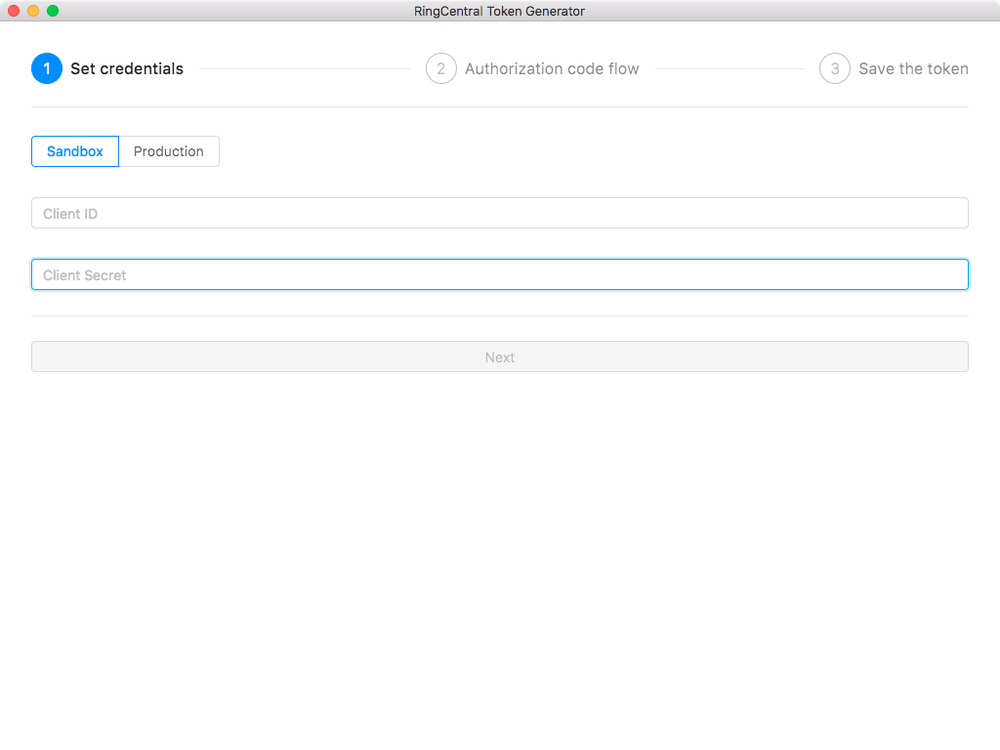

# ringcentral-token-generator

RingCentral token generator

For its usage, please refer to this [blog article](https://medium.com/ringcentral-developers/latest-glip-bot-provision-flow-a626a8dd0d98).


## Important notice

For private bots, you don't need this tool. And this tool doesn't work for private bot any more due the recent change from RingCentral server side.  If your bot is a private bot, you can get access token right from the GUI. Just set redirect uri to default value (https://www.ringcentral.com)

For public bots, this tool still works as it did.


## Screenshot




### [Download](https://github.com/tylerlong/ringcentral-token-generator/releases)


## Setup

```
yarn install
yarn run upgrade
```


## Development

```
yarn build:watch
yarn start
```


## Pack

```
yarn dist:dev
```


## Distribution

```
yarn dist
```
